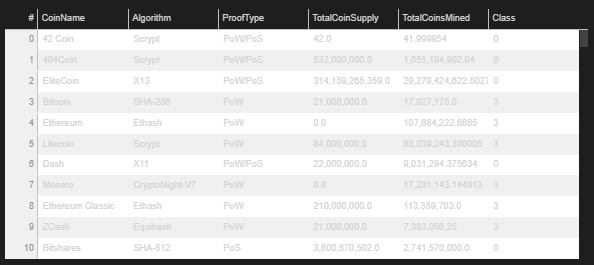

# Cryptocurrencies

For this challenge, we were tasked with creating a report detailing what cryptocurrencies were trading on the market and how they could be grouped and classified together for an investment bank. The first part of our assignment was using pandas to preprocess the data so it could be fit into a machine learning model. We used a clustering algorithm to group the cryptocurrencies together then used visualizations to share our findings. 

For the first part of our deliverable, we needed to clean up the data so we could use it to fit our unsupervised machine learning model. We took our raw data, trimmed it down to current cryptocurrencies that were trading and had a working algorithm then dropped columns that wouldn’t be needed in our clustering algorithm. Our final dataframe was the crypto dataframe that contained the name of the cryptocurrencies as the index, the algorithm used, Proof Type, Coins Mined, and Total Coin supply. 
In the second deliverable, we used PCA to reduce the dimensions in our dataset to three dimensions from the dataframe we created in the get_dummies() stage in our preprocessing. The PCA dataframe that we created looks like the following:

In the third deliverable, we used the KMeans method to create an elbow curve to find the best number of clusters to group our cryptocurrency data. After going through the process of finding the best value for K from the pcs_df, we used the dataframe to run the KMeans algorithm to make predictions of the K clusters. We then created a bigger dataframe which merged the PCA dataframe with the crypto dataframe we created in the first deliverable. This dataframe had all of the information that we needed to chart the data that we gathered on the cryptocurrencies. That dataframe is as follows:

The fourth and final step in our project was charting and presenting all of our findings. The first step was to create a 3D scatter plot to plot the three PCA clusters so we could visualize where the cryptocurrencies were grouped among the classes predicted. The visualization is as follows:

In the next step in our visualization process was to create a table using the hvplot.table() function. In this step we took our clustered_df and created a table that is sortable and selectable were you can click on the column and it will filter from ascending to descending or descending to ascending. The looks like the following:

The next step in this deliverable we took the Total Coined Mined and the Total Coin Supply and used the MinMaxScaler() method to scale the columns down to a value between 0 and 1. Once we used this method, we created a dataframe with this scaled data then added to Coin Name and Class to it. The final dataframe looks like the following:

With this data frame, we created a scatter plot with hvplot to plot the Total Coins Mined by the Total Coin Supply. When you hover over the plot on the graph you are able to see the Class, Total Coins Mined, Total Coin Supply, and the Coin Name. The final scatter plot looks like the following:

By preprocessing, scaling and plotting the data, we used unsupervised machine learning to classify cryptocurrencies by certain classes so that the investment bank can better explain the portfolio of cryptocurrencies to their clients. 
